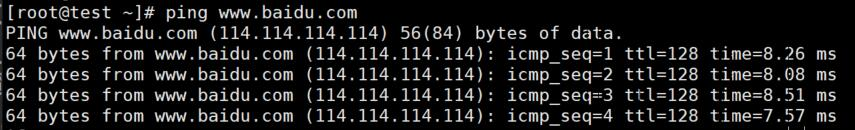
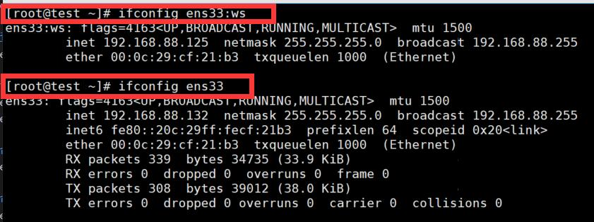

# 网络配置
## 配置网卡IP、DNS、网关、MTU、混合模式等

### 常见的与网络相关的配置文件
* /etc/hostname # 主机名（计算机的名字）
```
[root@yujmo ~]# cat /etc/hostname # 查看主机名
[root@yujmo ~]# vim /etc/hostname # 修改主机名为test
# 注销用户再重新登录，查看主机名修改的结果
```

* /etc/hosts # 完成主机名映射为IP地址的功能
```   
[root@test ~]# cat /etc/hosts
127.0.0.1   localhost localhost.localdomain localhost4 localhost4.localdomain4
::1         localhost localhost.localdomain localhost6 localhost6.localdomain6

# 第一行的解析效果是将localhost localhost.localdomain localhost4 localhost4.localdomain4解析为127.0.0.1

在/etc/hosts文件中新增一条记录
114.114.114.114 www.baidu.com   将www.baidu.com解析为114.114.114.114
[root@test ~]# ping www.baidu.com # 使用ping命令去ping www.baidu.com
```
使用ping命令ping www.baidu.com，其结果如下：


    # /etc/hosts文件很危险，如果有人恶意的修改这个文件，比如将淘宝的网站域名解析到了钓鱼网站，这样的话就会造成
    财产的损失。


* /etc/resolv.conf 指定DNS服务器的IP地址
```
[root@test ~]# vim /etc/resolv.conf 
# Generated by NetworkManager
search localdomain
nameserver 127.0.0.1 # 指定DNS服务器的IP地址

[root@test ~]# ping www.baidu.com # 再去Ping 百度，以验证修改DNS服务器IP地址的结果
ping: www.baidu.com: 未知的名称或服务

```

* /etc/sysconfig/network-scripts/  # 该目录下存放了网卡的配置信息
```
    [root@test ~]# find / -name ifcfg-ens33 # 在根目录下面寻找名为ifcfg-ens33的文件
    [root@test ~]# find / -name ifcfg-* # 在根目录下面寻找开头为ifcfg-的文件
```


### 本地环回接口lo
    lo:local
    假设数据包从一个本地进程产生，通过本地环回接口lo传输到另外一个进程

### 查看网卡配置信息
```
[root@test network-scripts]# vim ifcfg-ens33  # 查看网卡配置信息
TYPE="Ethernet"   # 类型
BOOTPROTO="dhcp"  # 开机协议
NAME="ens33"
UUID="2dc5c628-b111-4cc9-9e05-951dd73d9652" # UUID号
DEVICE="ens33"    # 设备名
ONBOOT="yes"      # 是否开机启动网卡

BOOTPROTO最常见的三个参数： 
    static：静态ip（手动设置IP）
    dhcp：动态获取IP
    none：从字面意思去看，看上去是没有ip的意思。其实不是的，聚合多个网卡的时候必须设置BOOTPROTO为none
```

### 修改网卡配置文件设置DHCP方式上网
```
[root@test network-scripts]# cat ifcfg-ens33 #Linux系统中
BOOTPROTO="dhcp"
DEVICE="ens33"
ONBOOT="yes"
[root@test network-scripts]# cat ifcfg-ens33 |grep BOOTPROTO  # grep命令是一种强大的文本搜索工具，它能使用正则表达式搜索文本，并把匹配的行打印出来。# 打印包含”BOOTPROTO“字符串的行
BOOTPROTO="dhcp"

[root@test network-scripts]# ip addr # 查看ip地址
[root@test network-scripts]# systemctl restart network # 重启下网络服务
```

### 设置静态IP上网
```
[root@test ~]# vim /etc/sysconfig/network-scripts/ifcfg-ens33 
BOOTPROTO="static"     
DEVICE="ens33"  
ONBOOT="yes"
IPADDR="192.168.88.132"  # 指定ip地址
NETMASK="255.255.255.0"  # 指定子网掩码
DNS1="114.114.114.114"   # 指定DNS地址 
GATEWAY="192.168.88.2"   # 指定网关地址
```

### 单块网卡设置多个IP地址
```
[root@test network-scripts]# cp ifcfg-ens33 ifcfg-ens33:0
[root@test network-scripts]# cp ifcfg-ens33 ifcfg-ens33:ws
[root@test network-scripts]# cat ifcfg-ens33:0  # 修改其中一块虚拟网卡的配置文件
BOOTPROTO="static"
DEVICE="ens33:0"
ONBOOT="yes"
IPADDR="192.168.88.133"
NETMASK="255.255.255.0"
DNS1="114.114.114.114"
GATEWAY="192.168.88.2"
[root@test network-scripts]# systemctl restart network
```

### 命令行开启、关闭网卡
```
[root@test network-scripts]# ifdown ens33 # 关闭网卡
[root@test network-scripts]# ifup ens33 #开启网卡
```
### 查看网卡信息
```
[root@test ~]# nmcli connection show
NAME          UUID                                  TYPE      DEVICE 
System ens33  c96bc909-188e-ec64-3a96-6a90982b08ad  ethernet  ens33 
```

### 查看网卡硬件信息
```
[root@test ~]# nmcli device show ens33
```

### 查看网卡信息
```
[root@test ~]# ifconfig ens33
```

### 命令行开启、关闭网卡
```
[root@test ~]# ifconfig ens33 up
[root@test ~]# ifconfig ens33 down
```

### 命令行临时修改MTU值为1400
```
[root@test ~]# ifconfig ens33 mtu 1400
```

### 命令行临时设置ip地址和子网掩码
```
[root@test ~]# ifconfig ens33 192.168.88.67 netmask 255.255.255.0
[root@test ~]# ifconfig ens33:ws 192.168.88.125/24 
```



# 开启、关闭虚拟网卡
```
[root@test ~]# ifconfig ens33:ws down
[root@test ~]# ifconfig ens33:ws
ens33:ws: flags=4163<UP,BROADCAST,RUNNING,MULTICAST>  mtu 1500
        ether 00:0c:29:cf:21:b3  txqueuelen 1000  (Ethernet)
```

# 开启、关闭网卡的ARP协议
```
[root@test ~]# ifconfig ens33 arp
[root@test ~]# ifconfig ens33 -arp
```

# 单网卡多IP
```
[root@test ~]# ip addr add 192.168.88.198/24 dev ens33 
[root@test ~]# ip addr del 192.168.88.198/24 dev ens33 
```

### ip命令配置IP等
```
[root@test ~]# ip link set ens33 down         # 关闭网卡
[root@test ~]# ip link set ens33 up           # 开启网卡
[root@test ~]# ip link set ens33 mtu 1400           # 设置网卡最大传输单元
[root@test ~]# ip link set ens33 txqueuelen 1200    # 设置网卡队列长度
[root@test ~]# man ip # 查看ip命令的使用帮助
```

### 图形化设置ip(永久)
```
[root@test ~]# nm-connection-editor # 
[root@test ~]# nmtui
```